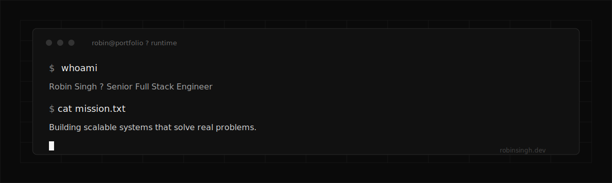
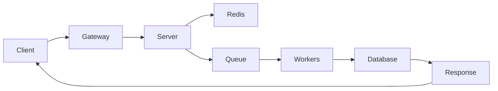

<p align="center">
  
</p>

<h1 align="center">Robin Singh</h1>

<p align="center">
  <strong>Senior Full Stack Engineer</strong><br />
  Building scalable systems that solve real problems.
</p>

<p align="center">
  <a href="https://robinsingh.dev">Live site</a> ·
  <a href="https://robinsingh.dev/#terminal">Terminal</a> ·
  <a href="https://robinsingh.dev/blog">Blog</a> ·
  <a href="mailto:robynsyngh@gmail.com">Email</a> ·
  <a href="https://www.linkedin.com/in/robin-singh-39a2841a3/">LinkedIn</a>
</p>

<p align="center">
  
  
  
  
  
  
</p>

---

<details open>
<summary><strong>Navigate</strong></summary>

<br />

- [What is this?](#what-is-this)
- [Try the terminal](#try-the-terminal)
- [Features](#features)
- [Request path](#request-path)
- [Projects](#projects)
- [Tech stack](#tech-stack)
- [Content editing](#content-editing)
- [Quick start](#quick-start)
- [Scripts](#scripts)
- [SEO & feeds](#seo--feeds)
- [Contact](#contact)

</details>

---

## What is this?

A monochrome, content-driven engineering portfolio that behaves like a product — not a template.

It showcases production systems thinking across FinTech, AI integrations, async workers, and durable architecture. Scroll storytelling (Lenis + GSAP), component motion (Framer Motion), an interactive terminal with easter eggs, and case studies that walk request paths instead of listing bullet-point stacks.

| Signal | Detail |
| --- | --- |
| Focus | Backend · FinTech · AI · Payments |
| Experience | Nearly 5 years |
| Current | Bridging Healthcare Technologies |
| Site | [robinsingh.dev](https://robinsingh.dev) |

---

## Try the terminal

The live site includes a portfolio runtime. Open [robinsingh.dev/#terminal](https://robinsingh.dev/#terminal) and type commands — or expand below for a local preview of the command surface.

<details>
<summary><strong>Available commands</strong></summary>

<br />

```text
robin@portfolio:~$ help

  help          List available commands
  about         Engineering summary
  whoami        Identity check
  projects      List featured projects
  skills        Production skill surface
  architecture  Jump the request path
  blog          Open writing
  contact       Get in touch
  resume        Download resume
  github        Open GitHub
  linkedin      Open LinkedIn
  clear         Clear the terminal
```

</details>

<details>
<summary><strong>Easter eggs</strong> — type something weird on purpose</summary>

<br />

| Command | What happens |
| --- | --- |
| `sudo hire robin` | Downloads the resume |
| `npm install robin` | Installs one senior engineer |
| `git log` | Career history |
| `redis-cli` | Fake cache session |
| `stripe test` | Payment animation |
| `coffee` | Developer Energy +100% |

</details>

<details>
<summary><strong>Sample session</strong></summary>

<br />

```text
Robin Singh Portfolio Runtime v1.0
Type `help` to list commands. Type something weird on purpose.

robin@portfolio:~$ whoami
Robin Singh · Senior Full Stack Engineer · India

robin@portfolio:~$ about
Senior full stack engineer focused on scalable backend systems,
FinTech, AI integrations, and production-grade architecture.

robin@portfolio:~$ sudo hire robin
Authenticating hiring privileges...
Permission granted.
Downloading resume.pdf...
```

</details>

---

## Features

<details open>
<summary><strong>Product surface</strong></summary>

<br />

- **Hero request graph** — animated client → gateway → workers → database path
- **Journey & skills** — production usage, constraints, and where each tool earns its place
- **Projects + case studies** — Stripe events, Redis without lying to yourself, BullMQ as infrastructure, OpenAI boundaries
- **Interactive terminal** — real commands + easter eggs
- **MDX blog** — systems writing, not generic tips
- **Scroll progress / request tracker** — the page as a running system
- **Content-only updates** — edit JSON/MDX under `content/`; components stay clean

</details>

<details>
<summary><strong>Engineering constraints (by design)</strong></summary>

<br />

- Monochrome palette — no purple themes, no glassmorphism, no gradient wallpaper
- GSAP for scroll timelines; Framer Motion for component motion
- All project data loaded from `content/` — never hardcoded in UI
- Accessibility + SEO first; Lighthouse target **> 95**

</details>

---

## Request path

How the hero system thinks about traffic:



---

## Projects

| Project | Type | Stack highlights |
| --- | --- | --- |
| **[Credee](https://robinsingh.dev/#projects)** | Production FinTech | Node.js · Stripe · Redis · BullMQ · MySQL · AWS |
| **[Practina](https://robinsingh.dev/#projects)** | Production AI marketing | Node.js · OpenAI · Google APIs · Redis · BullMQ |
| **[AI Interview Copilot](https://github.com/robynsyngh/ai-interview-copilot)** | Personal | Next.js · OpenAI · TypeScript |
| **[AI Credit Scoring Assistant](https://github.com/robynsyngh/ai-credit-scoring-assistant)** | Personal | Next.js · OpenAI · explainable decisions |

<details>
<summary><strong>Case study themes</strong></summary>

<br />

- Stripe webhooks as the source of truth (not clicks)
- Redis for latency without hiding consistency problems
- BullMQ for durable payments and AI jobs
- OpenAI features that need queues, cost controls, and failure modes

</details>

---

## Tech stack

```text
Next.js 15 (App Router) · TypeScript · Tailwind CSS 4
Lenis · GSAP + ScrollTrigger · Framer Motion
MDX (next-mdx-remote + @next/mdx)
Vercel Analytics · Speed Insights
```

<details>
<summary><strong>Repository layout</strong></summary>

<br />

```text
app/                 # routes, SEO, OG image, sitemap, feed
components/          # UI sections + providers
content/             # all site content (JSON + MDX + resume)
hooks/               # React / GSAP helpers
lib/                 # content loaders, MDX, types, SEO
public/              # static assets (synced resume)
scripts/             # resume sync
docs/assets/         # README visuals
PORTFOLIO_SPEC.md    # product / design source of truth
```

</details>

---

## Content editing

Everything visible on the site is driven from `content/`. Update JSON or MDX — do not hardcode project data in components.

```text
content/
├── profile.json
├── hero.json
├── journey.json
├── experience.json
├── projects.json
├── case-studies.json
├── skills.json
├── architecture.json
├── terminal.json
├── easter-eggs.json
├── achievements.json
├── contact.json
├── blog/*.mdx
└── resume.pdf
```

<details>
<summary><strong>Resume sync</strong></summary>

<br />

1. Place the PDF at `content/resume.pdf`
2. Run `npm run resume` to copy it into `public/`
3. Site + terminal `resume` / `sudo hire robin` use `/resume.pdf`

</details>

---

## Quick start

```bash
# install
npm install

# develop (Turbopack)
npm run dev

# production
npm run build && npm start
```

Open [http://localhost:3000](http://localhost:3000).

<details>
<summary><strong>Requirements</strong></summary>

<br />

- Node.js 20+ recommended
- npm (ships with this repo's lockfile)

</details>

---

## Scripts

| Command | Purpose |
| --- | --- |
| `npm run dev` | Local dev server with Turbopack |
| `npm run build` | Production build |
| `npm start` | Serve production build |
| `npm run lint` | ESLint |
| `npm run resume` | Sync `content/resume.pdf` → `public/` |

---

## SEO & feeds

| Route | Purpose |
| --- | --- |
| `/sitemap.xml` | Sitemap |
| `/robots.txt` | Crawlers |
| `/feed.xml` | RSS |
| `/opengraph-image` | OG image |
| JSON-LD | Home, blog, case studies |

---

## Contact

<p align="center">
  Prefer systems that settle correctly under retries?<br />
  <a href="mailto:robynsyngh@gmail.com"><strong>robynsyngh@gmail.com</strong></a>
  ·
  <a href="https://robinsingh.dev/#contact">Contact on site</a>
  ·
  <a href="https://github.com/robynsyngh">GitHub</a>
</p>

---

<p align="center">
  <sub>
    Content lives in <code>content/</code> · Spec lives in <code>PORTFOLIO_SPEC.md</code> · Site lives at
    <a href="https://robinsingh.dev">robinsingh.dev</a>
  </sub>
</p>
